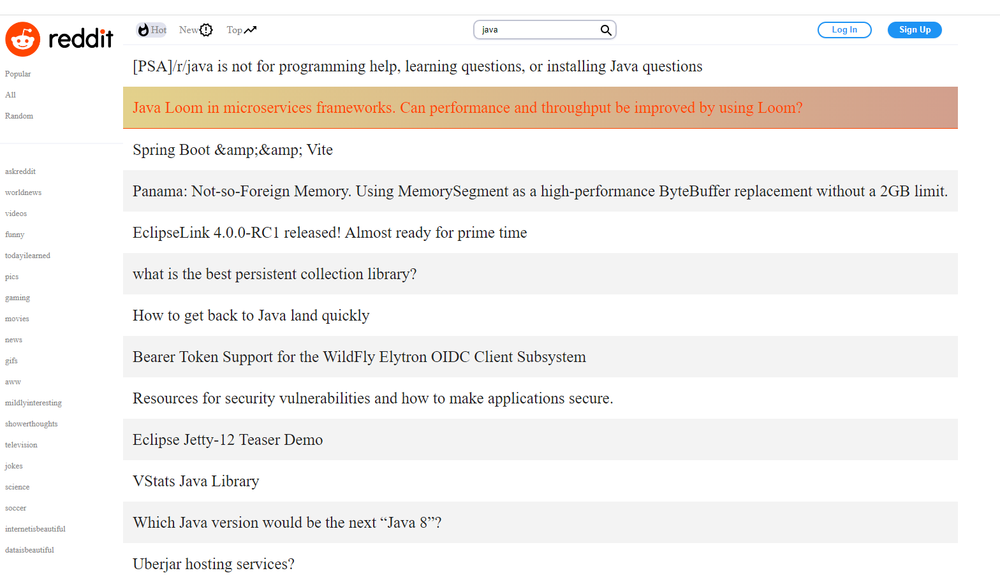

# Reddit client

This React web application uses the Reddit API to allow users to view and search posts provided by the API.\
This project was built to practice working with **React**, **React router** and **API**.

## Usage

This project was bootstrapped with [Create React App](https://github.com/facebook/create-react-app).\
This project was deployed using Netlify [here](https://anyonereddit.netlify.app/).

In the project directory, you can run:

### `npm start`

Runs the app in the development mode.\
Open [http://localhost:3000](http://localhost:3000) to view it in your browser.

The page will reload when you make changes.\
You may also see any lint errors in the console.

### `npm test`

Launches the test runner in the interactive watch mode.

## Features

At the starting page, users will be able to search for post/subreddits, once clicked on the post, it will 
take the user to the original post on the Reddit webpage.

## Future Development 

Update the UI to look like the real Reddit webpage.
Render the pictures and commend on the webpage. 

## Sources

This project was created as part of [Codecademy's Fullstack Engineer](https://www.codecademy.com/learn) curriculum. 
